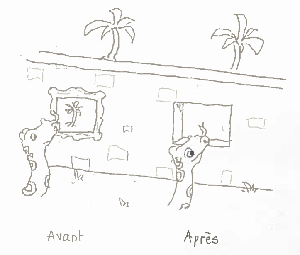

# Passer à Python 3


# PyCon FR 2019

---
## Qui suis-je ?

Développeur Freelance ou Pas, Autheur O'Reilly et Conférencier.

Mon crédo : les langages de programmation ne sont que des outils; plus on en a dans sa boîte, mieux on est équipé pour répondre aux problématiques du client.

Je m'efforce donc de pratiquer un ensemble de langages de programmation complémentaires. Java depuis 1996, Python depuis 1998, Ruby depuis 2005 et Go depuis 2014.

[michel.casabianca@gmail.com](mailto:michel.casabianca@gmail.com)

<http://sweetohm.net>

<http://github.com/c4s4>

<http://linkedin.com/in/casabianca>

---
## Faut-il passer à Python 3 ?

Le titre de la première version de cette présentation, qui datait de 2015, était : **Faut-il Passer à Python 3 ?** La question ne se pose plus car la fin de vie de python 2 est programmée au le [1er janvier 2020](https://pythonclock.org/).

### La fin de Python 2 c'est dans 60 jours !

Si vous n'avez pas migré vos projets critiques, il est urgent de le faire car après cette date il n'y aura **plus de mise à jour de sécurité** pour Python 2. Si votre projet a de fortes contraintes de sécurité et doit être mis à jour régulièrement, vous exposerez vos utilisateurs à de gros soucis.

Si de plus vous êtes tenu par des normes de sécurité, comme PCIDSS qui impose des mises à jour de sécurité régulières, vous risquez de gros ennuis.

---
## Les nouveautés de Python 3

Python 3 (ou Python 3000 ou encore Py3k) est une refonte de Python, incompatible avec les versions 2, qui a commencé le **5 avril 2006** (avec le PEP 3000) et qui a abouti à la release de Python 3.0.0 le **3 décembre 2008**.

Depuis, nombre de fonctionnalités ont été **backportées** vers les versions 2 (accessible avec les imports `from __future__`).

Un document liste les changements de Python 3 :

<https://docs.python.org/3.8/whatsnew/3.0.html>

---
### La fonction print

Print n'est plus une déclaration mais une fonction :

```python
# avant
print "Hello World!"
# après
print("Hello World!")
```

Les formes les plus bizarres ont été rationalisées :

```python
# avant
print "pas de retour à la ligne",
print >>sys.stderr, "erreur"
print ("spam", "eggs")
# après
print("pas de retour à la ligne", end=" ")
print("erreur", file=sys.stderr)
print(("spam", "eggs"))
```

On peut utiliser ces nouvelles formes dans un source Python 2 avec l'import `from __future__ import print_function`. L'outil *2to3* est capable de réaliser la conversion automatiquement pour vous.

---
### Vues et itérateurs au lieu de listes

En Python 2, `dict.keys()`, `dict.values()` et `dict.items()` renvoient une liste. Cette liste est valide au moment de l'appel et si le dictionnaire est modifié, la liste ne l'est pas. D'autre part, cette liste est modifiable.

En Python 3, ces appels renvoient des vues (*views* en anglais). Ces vues reflètent l'état du dictionnaire, même après modification. D'autre part, ces vues ne sont pas modifiables.

On peut voir la différence entre listes et vues de la manière suivante :



---
### Fonctions map, filter et zip

Les fonctions `map()`, `filter()` et `zip()` renvoient aussi des vues. Pour les deux premières, il faut les remplacer par des list comprehensions :

```python
import math
# avant
print map(math.factorial, range(6))
print filter(lambda x: x % 2 == 0, range(6))
# après
print([math.factorial(x) for x in range(6)])
print([x for x in range(6) if x % 2 == 0])
```

Ces formes avec list comprehensions sont bien plus claires et tout aussi rapides que les versions avec fonctions.

---
### Chaînes de caractères

En Python 2, les chaînes de caractères sont de deux types : **unicode** et **8-bits**. On peut mixer les deux, mais cela conduit souvent à des erreurs de type `UnicodeDecodeError`.

En Python 3, le type qui contient du texte est **str** et celui qui contient de la donnée est **bytes**. On ne peut mixer les deux, sans quoi on lève une `TypeError`.

On peut préparer la migration en n'utilisant en Python 2 que des **chaînes unicode** pour contenir du texte et **effectuer explicitement** les conversions entre `str` et `bytes`. Alors l'outil *2to3* pourra effectuer la majeure partie du travail pour vous.

Il y aurait beaucoup à dire sur le sujet des chaînes de caractères et des données binaires, pour plus de détails sur ce sujet, voir le Unicode Howto : <https://docs.python.org/3.5/howto/unicode.html>.

---
### Autres changements

- Comparaisons : on ne peut **plus comparer des types qui ne sont pas comparables**, donc `1 < ''` est interdit en Python 3 (lève une `TypeError`).
- Nombres entiers : **tous les entiers sont maintenant du type `long`**. Une division de nombres entiers comme `1/2` donne un `float`, pour effectuer une division entière on écrira `1//2`.

---
### Nouvelles syntaxes

- Annotations des arguments et valeurs de retour des fonctions.

```python
def repeat(s: str, n: int) -> str:
    return n*s
```

- Arguments de fonction ne pouvant qu'être nommés.

```python
>>> def func(*, foo, bar):
>>>     print(foo, bar)
>>> func(1, 2)
Traceback (most recent call last):
  File "<stdin>", line 1, in <module>
TypeError: func() takes 0 positional arguments but 2 were given
```

- Déclaration `nonlocal` qui permet d'assigner à une variable qui est dans une portée externe sans être globale.

---
### Nouvelles syntaxes (suite)

- Éclatement d'itérable avec reste :

```python
>>> x, y, *reste = range(5)
>>> print(reste)
[2, 3, 4]
```

A noter que `*reste` peut être placé ailleurs dans la liste des variables.

- Compréhension de dictionnaire :

```python
{65+c: chr(65+c) for c in range(26)}
```

Construira un dictionnaire associant une lettre majuscule à son code ASCII.

- Expression pour un set :


```python
>>> s = {1, 2, 2, 3, 3}
>>> print(s)
{1, 2, 3}
```

---
### Nouvelles syntaxes (suite)

- Nouvelle syntaxe pour les valeurs octales : on écrira **0o720** au lieu de **0720**, qui a disparu.
- Nouvelle syntaxe pour les valeurs binaires : on pourra écrire **0b1010** par exemple. Il y a une nouvelle fonction `bin()` pour convertir un nombre entier en sa représentation en binaire.
- Les valeurs de `bytes` commencent pas un **b** ou un **B** . Il y a une nouvelle fonction `bytes()` pour convertir un entier en sa représentation en une liste d'octets.

---
### Changements de syntaxe

- Exceptions avec causes :

```python
raise Exception("exception") from Exception("cause")
# équivalent à
e = Exception("exception")
e.__cause__ = Exception("cause")
raise e
```

- Capture des exceptions, on doit écrire :

```python
# avant
except Exception, e:
    ...
# après
except Exception as e:
    ...
```

- Une méta-classe n'est plus un attribut `__metaclass__` d'une classe :

```python
class C(metaclass=M):
    ...
```

---
### Syntaxes supprimées

- Les antiquotes doivent être remplacées par **`repr()`**.
- Les `<>` doivent être remplacés par **`!=`**.
- Le mot clé `exec` est remplacé par la fonction **`exec()`**.
- On ne peut plus ajouter un `l` ou un `L` à la fin des entiers (car **tous les entiers sont des longs**).
- On ne peut plus placer `u` ou `U` devant un chaîne (car toutes les chaînes sont Unicode).
- La syntaxe **`from module import *` n'est plus autorisée** dans les fonctions, mais seulement au niveau module.
- La seule syntaxe admise pour les imports relatifs est **`from .module import name`**. Tous les `import from` non précédés d'un point sont considérés comme absolus.
- Les **classes *Classic*** (ou de style ancien) n'existent plus.
- Le **formatage des chaînes avec l'opérateur `%` ne sera plus supporté** dans une future version et est remplacé avantageusement par les **f-strings** du type **`f"Hello {name}!"`**.

---
### Changements divers

- Le concept **d'*unbound method*** a été abandonné et remplacé par de simples fonctions.
- On peut enfin invoquer **`super()` sans argument** et cela renvoie la classe ou l'instance parente.
- La fonction **`raw_input()` a été renommée `intput()`**. Pour retrouver l'ancien comportement, on écrira `eval(input())`.
- Le type **`file` n'existe plus**.
- **`dict.has_key()` n'existe plus**, utiliser l'opérateur `in` à la place.

---
### Changements dans les bibliothèques

- Des bibliothèques ont été **abandonnées** par manque d'utilisateurs ou suite à l'arrêt du support de plateformes (comme BeOS ou MacOS9).
- Des bibliothèques ont été **renommées** pour adhérer au PEP 0008 : `ConfigParser` par exemple a été renommé en `configparser`.
- Les bibliothèques mixtes (avec version pure Python et implémentée en C) ont été **fusionnées** de manière à ce que l'utilisateur n'aie pas à choisir la version utilisée.
- Des bibliothèques ont été **regroupées** : par exemple *urllib*, *urllib2*, *urlparse* et *robotparse* ont été regroupées dans *urllib*.
- D'autres bibliothèques enfin ont été nettoyées, comme *sys* par exemple.

---
## Migration vers Python 3

Avant d'entreprendre la migration, il faut se poser les questions suivantes :

- Toutes les bibliothèques que j'utilise ont-t-elles été portées vers Python 3 ?
- Souhaite-t-on garder une compatibilité avec Python 2 ?
- Si oui, veut-on releaser :
  - Une seule version compatible avec Python 2 et 3 simultanément
  - Deux versions distinctes : une pour Python 2 et une pour 3

Maintenant que le support pour Python 2 va cesser dans quelques semaines, il me semble qu'une version compatible n'est plus indispensable, sauf cas particulier rare.

Du code compatible avec les deux versions est plus facile à maintenir, mais le code n'est pas très élégant.

---
### Préparer la migration

Pour que la migration se passe dans de bonnes conditions, il est très utile de préparer le terrain en amont en prenant les mesures suivantes :

- S'assurer que toutes les dépendances sont compatibles Python 3 (avec [caniusepython3](https://pypi.org/project/caniusepython3/) par exemple)
- Valider son code avec [Pylint](https://www.pylint.org/)
- S'assurer que le code est bien couvert par des tests unitaires
- Des tests d'intégration sont très utiles, si possible automatisés, à défaut sous forme de cahiers de tests
- Rapprocher son code Python 2 le plus possible du 3 :
  - Utiliser les features Python 3 à l'aide des **from \_\_future\_\_ import ...**
  - N'utiliser que des chaînes Unicode et réaliser des conversions explicites avec des chaînes 8 bits
  - Corriger les warnings levés par l'option **-3** de Python (qui indique les features enlevées ou modifiées dans Python 3)

---
### Outils pour la migration

Pour réaliser la migration, on peut utiliser les outils suivants :

- **from \_\_future\_\_** est une série d'imports (*division*, *absolute\_import*, *print\_function* et *unicode\_literals*) qui permettent d'utiliser des fonctionnalités Python 3 dans un source Python 2.

- **-3** est une option de la commande Python qui lève des warnings pour le code Python 2 qui ne peut être automatiquement converti vers 3 avec l'outil *2to3*.

- [2to3](https://docs.python.org/fr/3.8/library/2to3.html) est un outil qui réalise la transformation d'un source Python 2 vers 3. Il faut cependant avoir réalisé un travail préparatoire, en particulier sur les chaînes de caractère.

- [six](https://pypi.org/project/six/) est une bibliothèque permettant de réaliser du code compatible Python 2 et 3.

- [futurize](http://python-future.org/automatic_conversion.html) est un outil qui automatise le support de Python 2 et 3 simultanément

---
### Procédure de migration

- S'assurer, avant la migration, que l'on a une bonne couverture de tests.
- Portage vers Python 2.7.
- Activer les warnings Python 3 avec l'option *-3*.
- Tester et éditer jusqu'à ce qu'il ne reste plus de warning.
- Utiliser l'outil *2to3* pour convertir le source vers Python 3. Ne pas éditer les sources résultants à la main !
- Tester le code avec Python 3.
- Si des problèmes persistent, corriger le source Python 2 et reprendre à partir de l'étape 4.
- On releasera deux versions : une Python 2 et une Python 3.

Il est conseillé de ne pas éditer le code Python 3 tant que l'on assure le support de la version Python 2.

Il est conseillé de ne pas faire de code compatible Python 2 *et* Python 3, mais de maintenir un source Python 2 capable de migrer automatiquement vers Python 3 avec l'outil *2to3*. On distribuera alors deux versions, compatibles avec une version de Python.

---
## Adoption de Python 3

L'adoption de Python 3 a été lente au début mais a fortement accéléré ces deux dernières années (d'après un sondage effectué par JetBrains fin 2018):


---
### Migration des bibliothèques

Le site [py3readiness.org](http://py3readiness.org/) indique que les 360 bibliothèques les plus utilisées ont été à ce jour portées vers Python 3 :


---
## Conclusion

S'il semble maintenant évident qu'il faut migrer sans tarder les projets vers Python 3, il ne faut pas négliger le coût de la migration : 

- Le travail préparatoire est important
- Les outils de migration ne réalisent pas tout le travail

# Merci

[michel.casabianca@gmail.com](michel.casabianca@gmail.com)
