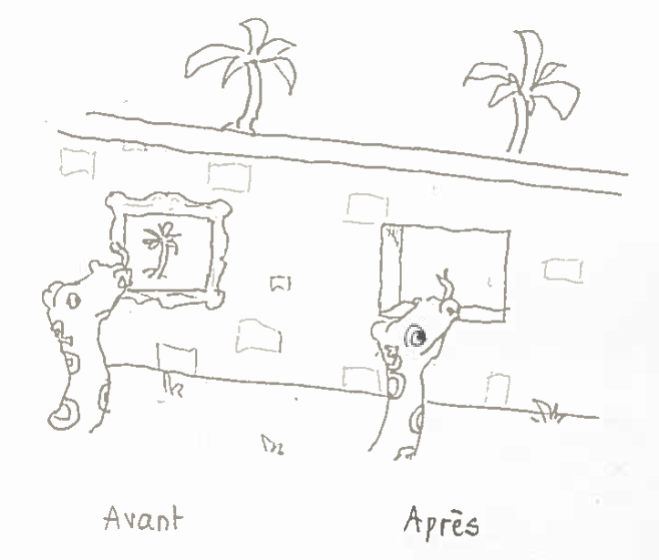

Faut-il passer à Python 3 ?
===========================

Michel Casabianca

BDX.io 2015

---
Les nouveautés de Python 3
--------------------------

Python 3 (ou Python 3000 ou encore Py3k) est une refonte de Python, incompatible avec les versions 2, qui a commencé le 5 avril 2006 (avec le PEP 3000) et qui a abouti à la release de Python 3.0.0 le 3 décembre 2008.

Depuis, nombre de fonctionnalités ont été backportées vers les versions 2 (accessible avec les imports `from __future__`.

Un document liste les changements de Python 3 :

<https://docs.python.org/3.5/whatsnew/3.0.html>

---
### La fonction print

Print n'est plus une déclaration mais une fonction :

```python
# avant
print "Hello World!"
# après
print("Hello World!")
```

Les formes les plus bizarres ont été rationalisées :

```python
# avant
print x,
print >>sys.stderr, "error"
print (x, y)
# après
print(x, end=" ")
print("error", file=sys.stderr)
print((x, y))
```

On peut utiliser ces nouvelles formes en Python 2 avec l'import `from __future__ import print_function`, mais on ne peut plus utiliser les formes autorisées en Python 2.

---
### Vues et itérateurs au lieu de listes

En Python 2, `dict.keys()`, `dict.values()` et `dict.items()` renvoient une liste. Cette liste est valide au moment de l'appel et si le dictionnaire est modifié, la liste ne l'est pas. D'autre part, cette liste modifiable.

En Python 3, ces appels renvoient des vues (*views* en anglais). Ces vues reflètent l'état du dictionnaire, même après modification. D'autre part, ces vues ne sont pas modifiables.

On peut voir la différence entre listes et vues de la manière suivante :



---
### Fonctions map, filter et zip

Les fonctions `map()`, `filter()` et `zip()` renvoient aussi des vues. Pour les deux premières, il faut les remplacer par des list comprehensions :

```python
import math
# avant
print map(math.factorial, range(6))
print filter(lambda x: x % 2 == 0, range(6))
# après
print([math.factorial(x) for x in range(6)])
print([x for x in range(6) if x % 2 == 0])
```

Ces formes avec list comprehensions sont bien plus claires et tout aussi rapides que les versions avec fonctions.

---
### Chaînes de caractères

En Python 2, les chaînes de caractères sont de deux types : unicode et 8-bits. On peut mixer les deux, mais cela conduit souvent à des erreurs de type `UnicodeDecodeError`.

En Python 3, le type qui contient du texte est `str` et celui qui contient de la donnée est `bytes`. On ne peut mixer les deux, sans quoi on lève une `TypeError`.

On peut préparer la migration en n'utilisant en Python 2 que des chaînes unicode pour contenir du texte et effectuer explicitement les conversions entre `str` et `bytes`. Alors l'outil *2to3* pourra effectuer la majeure partie du travail pour vous.

Il y aurait beaucoup à dire sur le sujet des chaînes de catactères et des données binaires, pour plus de détails sur ce sujet, voir le Unicode Howto : <https://docs.python.org/3.5/howto/unicode.html>.

---
### Autres changements

- Comparaisons : on ne peut plus comparer des types qui ne sont pas comparables, donc `1 < ''` est interdit en Python 3 (lève une `TypeError`).
- Nombres entiers : tous les entiers sont maintenant du type `long`. Une division de nombres entiers comme `1/2` donne un ̀`float`, pour effectuer une division entière on écrira `1//2`.

---
### Nouvelles syntaxes

- Annotations des arguments et valeurs de retour des fonctions.

```python
def repeat(s: str, n: int) -> str:
    return n*s
```

- Arguments de fonction ne pouvant qu'être nommés.

```python
>>> def func(*, foo, bar):
>>>     print(foo, bar)
>>> func(1, 2)
Traceback (most recent call last):
  File "<stdin>", line 1, in <module>
TypeError: func() takes 0 positional arguments but 2 were given
```

- Déclaration `nonlocal` qui permet d'utiliser une variable qui n'est ni locale ni globale.

---
### Nouvelles syntaxes (suite)

- Éclatement d'itérable avec reste :

```python
>>> x, y, *reste = range(5)
>>> print(reste)
[2, 3, 4]
```

- Compréhension de dictionnaire :

```python
{c: chr(c) for c in range(256)}
```

Construira un dictionnaire associant un caractère à son code ASCII.

- Expression pour un set :


```python
>>> s = {1, 2, 2, 3, 3}
>>> print(s)
{1, 2, 3}
```

---
### Changements de syntaxe

- Exceptions avec causes :

```python
raise EXCEPTION from CAUSE
# équivalent à
exc = EXCEPTION
exc.__cause__ = CAUSE
raise exc
```

- Capture des exceptions, on doit écrire :

```python
except Exception as var:
    ...
```

- Une méta-classe n'est plus un attribut `__metaclass__` d'une classe :

```python
class C(metaclass=M):
    ...
```

---
### Syntaxes supprimées

- Les antiquotes doivent être remplacées par `repr()`.
- Les `<>` doivent être remplacés par `!=`.
- Le mot clé `exec` est remplacé par la fonction `exec()`.
- On ne peut plus ajouter un `l` ou un `L` à la fin des entiers.
- On ne peut plus placer `u` ou `U` devant un chaîne.
- La syntaxe `from module import *` n'est plus autorisée dans les fonctions, mais seulement au niveau module.
- La seule syntaxe admise pour les imports relatifs est `from .module import name`. Tous les `import from` non précédés d'un point sont considérés comme absolus.
- Les classes *Classic* (ou de style ancien) n'existent plus.
- Le formatage des chaînes avec l'opérateur `%` ne sera plus supporté dans une future version et est remplacé par la méthode `format()` de la classe `str`.

---
### Changements divers

- Le concept d'*unbound method* a été abandonné et remplacé par de simples fonctions.
- On peut enfin invoquer `super()` sans argument et cela renvoie la classe ou l'instance parente.
- La fonction `raw_input()` a été renommée `intput()`, pour avoir l'ancien comportement, appeler `eval(input())`.
- Le type `file` n'existe plus.
- `dict.has_key()` n'existe plus, utiliser l'opérateur `in` à la place.

---
### Changements dans les bibliothèques

- Des bibliothèques ont été **abandonnées** par manque d'utilisateurs ou suite à l'arrêt du support de plateformes (comme BeOS ou MacOS9).
- Des bibliothèques ont été **renommées** pour adhérer au PEP 0008 : `ConfigParser` par exemple a été renommé en `configparser`.
- Les bibliothèques mixtes (avec version pure Python et implémentée en C) ont été **fusionnées** de manière à ce que l'utilisateur n'aie pas à choisir la version utilisée.
- Des bibliothèques ont été **regroupées** : par exemple *urllib*, *urllib2*, *urlparse* et *robotparse* ont été regroupées dans *urllib*.
- D'autres bibliothèques enfin ont été nettoyées, comme *sys* par exemple.

---
Procédure de migration
----------------------

1. S'assurer, avant la migration, que l'on a une bonne couverture de tests.
2. Activer les warnings Python 3.
3. Tester et éditer jusqu'à ce qu'il ne reste plus de warning.
4. Utiliser l'outil *2to3* pour convertir le source vers Python 3. Ne pas éditer les sources résultants à la main !
5. Tester le code avec Python 3.
6. Si des problèmes persistent, corriger le source Python 2 et reprendre à partir de l'étape 3.
7. On releasera deux versions : une Python 2 et une Python 3.

Il est conseillé de ne pas éditer le code Python 3 avant de ne plus assurer le support de la version Python 2.

---
Les chiffres sur la migration
-----------------------------

Des chiffres de migration vers Python 3 sont disponibles :

Python | 2012 | 2015
------ | ---- | ----
2.4    | 1    | 0
2.5    | 1    | 0
2.6    | 14   | 2
2.7    | 83   | 81
3.0    | 0    | 0
3.1    | 0    | 0
3.2    | 0    | 0
3.3    | 1    | 1
3.4    | 0    | 16

L'adoption de Python 3 a donc commencé très lentement, mais elle s'accélère depuis peu.

Ressources
----------

<http://sametmax.com/python-3-est-fait-pour-les-nouveaux-venus/>

<http://astrofrog.github.io/blog/2015/05/09/2015-survey-results/>

---
Outils de migration
-------------------

2to3

six

Python 3 warning mode : démarrer Python avec l'option `-3`, indique alors les incompatibilités qui ne peuvent être gérées par *2to3*.

From future : division, absolute\_import, print\_function et unicode\_literals (<https://docs.python.org/2/library/__future__.html>).
